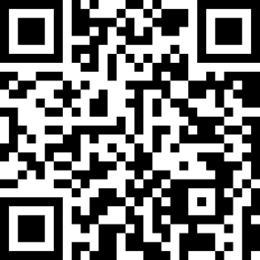

Hello there!

To-Do-List App (React Native Expo)

For iOS demo guide

- Download [Expo Go App](https://apps.apple.com/us/app/expo-go/id982107779)

* Scan below QR code with camera app

- Click "`Open in Expo Go`" link on camera

(Optional) expo snacks QR code [link](https://snack.expo.dev/@kaungnyuntsan1/to-do-list)

 

 

[Download](https://expo.dev/artifacts/eas/k2b7VRZFKZkZcfdZr9o2LQ.apk) Android App Demo.
